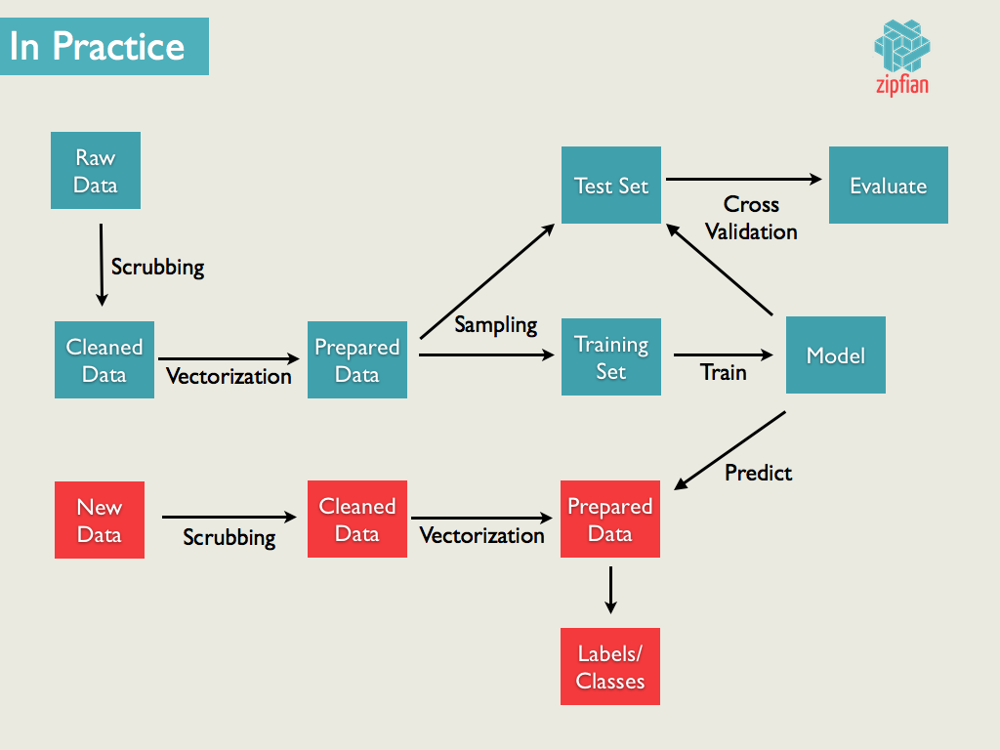
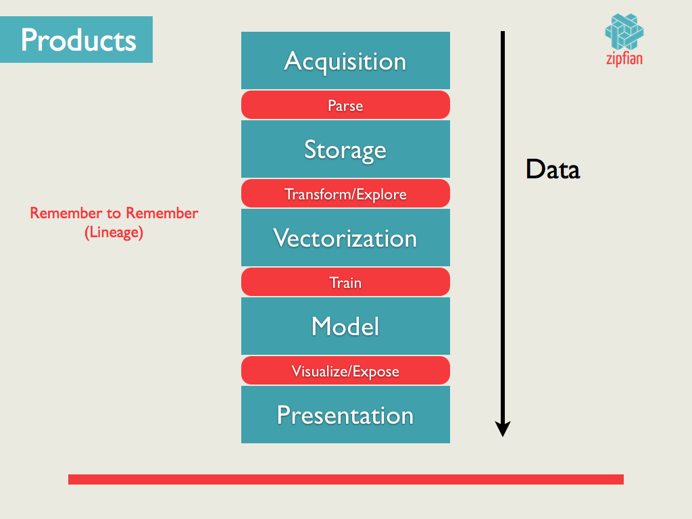

Main teacher: Jonathan

## Overview -- Data Products: Web apps with [Flask](http://flask.pocoo.org/) (mini-project)

Throughout the course we have been working with parsing data, tranforming text, building models, statistically validating our results, etc., etc., etc.  This has been much work and it might have been hard to see where it all was leading.  This sprint is designed to tie everything together, and after all, your best insight/model is only as good as your capacity to share it with the world!

In this sprint we will be taking one of our previous analyses and getting one online for the world to interact with. 

### Example Data Science workflow:
1. Run a scraper on an AWS EC2 instance to download NYT articles.
2. Store these articles intermediately on the EC2 machine (possibly in a database) for some querying and processing.
3. Batch upload a database dump to S3 periodically (as your database fills up).
4. Use Mortar (with Pig or Python) to locally (on your laptop) experiment with your data and build a model on a subset of the data.
5. Train a model at scale over all of your data located in S3 (Mortar runs in production on EC2 instances)
6. Serialize your trained model parameters to MongoDB (or [DynamoDB](http://aws.amazon.com/dynamodb/)) using the proper Pig [adapters](http://help.mortardata.com/reference/loading_and_storing_data/MongoDB).
7. (Optional) Deserialize trained model parameters from MongoDB into a Python [class](http://blog.yhathq.com/posts/image-classification-in-Python.html) (or [R function](http://blog.yhathq.com/posts/recommender-system-in-r.html)) and deploy to [yHat](http://yhathq.com/docs/quickstarts/py).
8. Write a simple web application with [Flask](http://flask.pocoo.org/) to expose your model to the world. This is essential to capture input from users and also provide output from your model.  In our case, this could be as simple as a form to input a url to an article, and provide the user back with the section of the NYT it should belong to.
9. If your model is deployed to yHat you simply use their API (and wrapper functions) and call it directly from the Flask application. Otherwise you need to query your MongoDB for your model parameters, deserialize these into a model class in Python (or R) and run your model's predict() function using the user's input.  Respond with the result of the prediction (HTTP response or HTML page).
10. [Deploy](http://ryaneshea.com/lightweight-python-apps-with-flask-twitter-bootstrap-and-heroku) your web application to [Heroku](https://devcenter.heroku.com/articles/getting-started-with-python)

__We are somewhere near step #6__

## Reading

* Agile Data: p. 38-54
* [Pete Skomoroch: Data Exhaust](http://www.slideshare.net/pskomoroch/distilling-data-exhaust)
* [Python on Heroku](https://devcenter.heroku.com/articles/getting-started-with-python)

## Assignment: 

There are a lot of great tools for building a website without knowing (or wrestling) with the quirks of HTML and CSS.  If you want to learn HTML/CSS/Javascript, Jonathan knows too much about these technologies (and teaching them) so please bug him.  If you do not care too much for HTML, there are some great graphical tools below for making a quick prototype of a front end for a site.

#### Web Interface Tools:

* [Easel.io: Browser base dinterface builder](https://www.easel.io/)
* [Divshot: Mockup editor](http://www.divshot.com/)
* [Bootswatch: Free themes for Bootstrap](http://bootswatch.com/)
* [LayoutIt: Bootsrtap GUI designer](http://www.layoutit.com/)

We Have already created much of these "products", now is the fun part to complete the process. First choose which adventure you will complete: 

### Options

* NMF
	* Expose your NMF algorithm by allowing a user to input a URL or paste in text to a text box.
	* Return the top topics/themes of the users article/document and associated words for those themes.
* Naive Bayes
	* Same as above (NMF) but return the section an article belongs to.
	* Play around with new NYT articles or articles from a completely different publication/text.
* Recommender
	* Expose your recommender such that a user can input an Amazon product, and you tell them similar products.
* A/B
* Clustering
* Hadoop++
	* Train your Naive Bayes algorithm on a massive amount of data (Wikipedia or Common Crawl) in S3 with EMR.
	* Expose your trained model with the Flask web app.
* other

### Implementation

You can choose to implement whatever you want for this mini-project but you will have to present what you build tomorrow morning.  Ideally the class could access you application and play around with it themselves.  Take this as a chance to finish up one of the old assignments to completion as well as an opportunity to get experience with web technologies.  Whichever project you choose to implement, the following steps will be somewhat universal.  We will be using Flask to create our application.

__NOTE: You do not need to build an application with a front-end.  You can simply build an API that exposes your model, i.e. `curl --data text="Awesome new article abou..." http://api.mymodel.com/bayes`__

1. First read through this 'hello world' of Flask: [ReSTful API](http://blog.luisrei.com/articles/flaskrest.html)

2. Now hopefully you are a bit more familiar with the way the web works.  For our application there are a few requirements:

* Model training (offline)
* User input (i.e. article to classify)
* Prediction/analysis
* Return results
* Make it pretty?

3. You may already have a trained model (or analyses) that you want to expose to the world via an API.  First we need to serialize our model parameters.  For Naive Bayes this means our CPTs and Prior table.  For the recommender it will be the similarity matrix.  For NMF you will have to run the algorithm everytime someone inputs data.  Serialize your parameters to a hosted database (this will allow you to access your model in the cloud):

* [Heroku Postgres](https://addons.heroku.com/heroku-postgresql)
* [MongoLab](https://mongolab.com/welcome/)
* [EC2](http://aws.amazon.com/ec2/)

4. Now that we have our model serialized, we are ready to start exposing it.  We will not worry about a front end right now.  We need to setup routes for our app.  We need:

* POST -- user submits new data classify/recommend/etc., you return a label/recommendation/etc.
* GET -- accept no data, simply return instructions for the API (routes list, data format, etc.) 

Test your API locally on your laptop before sending it up to the cloud.  Make sure your GET and POST routes work.

5. For the POSTing of new data, you will accept user input in a somewhat raw form (text, URL, HTML, etc.).  In your web app you will need to scrub and transform this data to get it into a suitable form for classification.  Remember the layer cake!

6. Once you have the new input data in a properly vectorized form, you can run it through your model.  Write code in your Flask route to read in data from the database contianing the model parameters.  Predict the new label for the user input.  Return this in a [Response](http://flask.pocoo.org/docs/api/#flask.Response) object as JSON.

7. Now that you know your model works locally on your laptop, it is time to send it to the cloud!  Follow the Heroku [docs](https://devcenter.heroku.com/articles/getting-started-with-python) to create a free account and deploy an application (or deploy to EC2 on Amazon if you are comfortable with it).

8. You application will not have an interface (yet).  Here you can build one using some of the tools listed above.  Or you can leave your app simply as an API.  Once deployed to the cloud, use `curl` (or another HTTP library) to POST data to your application and hopefully it responds with a label/recommendation/etc.

__WARNING: Memory might be an issue with Heroku or other free hosting.  If you need more, I would recommend just using EC2__

9. $$$

## References

* [API design with Flask](http://blog.luisrei.com/articles/rest.html)
* [Flask + Bootstrap + Heroku](http://ryaneshea.com/lightweight-python-apps-with-flask-twitter-bootstrap-and-heroku)
* [Flask-restful](http://blog.miguelgrinberg.com/post/designing-a-restful-api-using-flask-restful)

